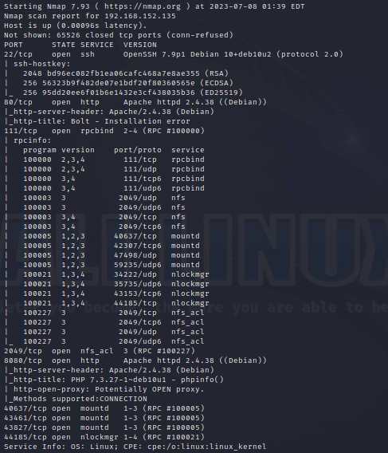
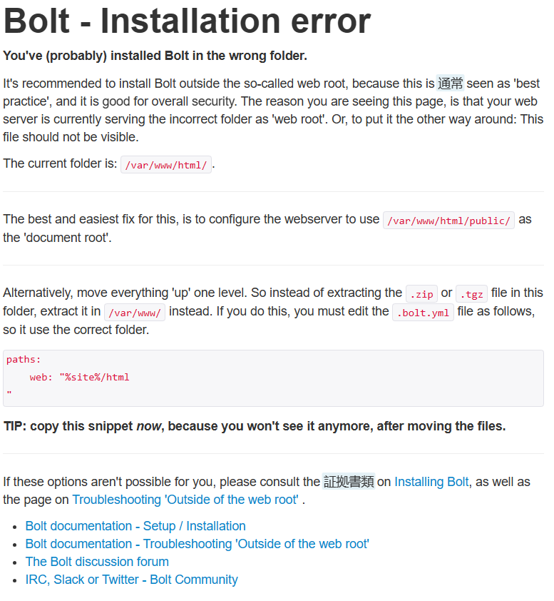
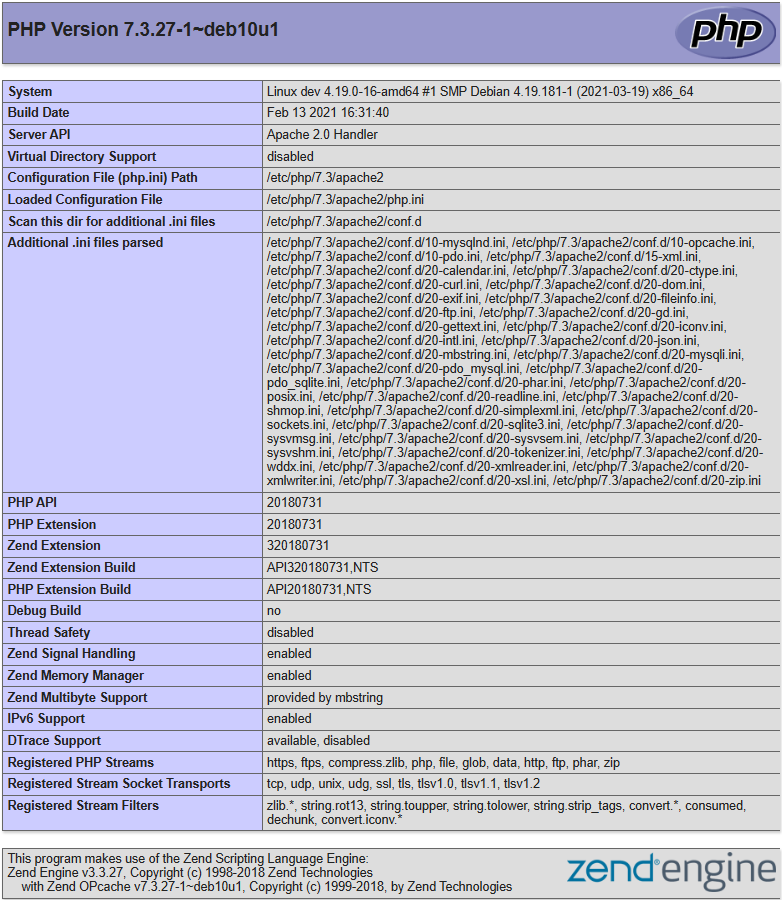
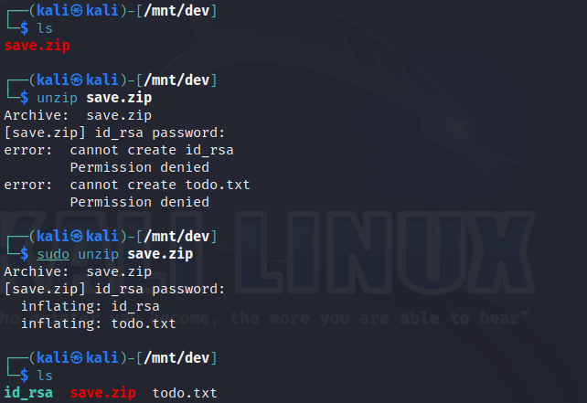
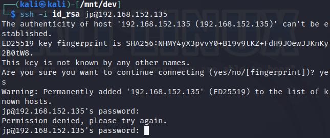
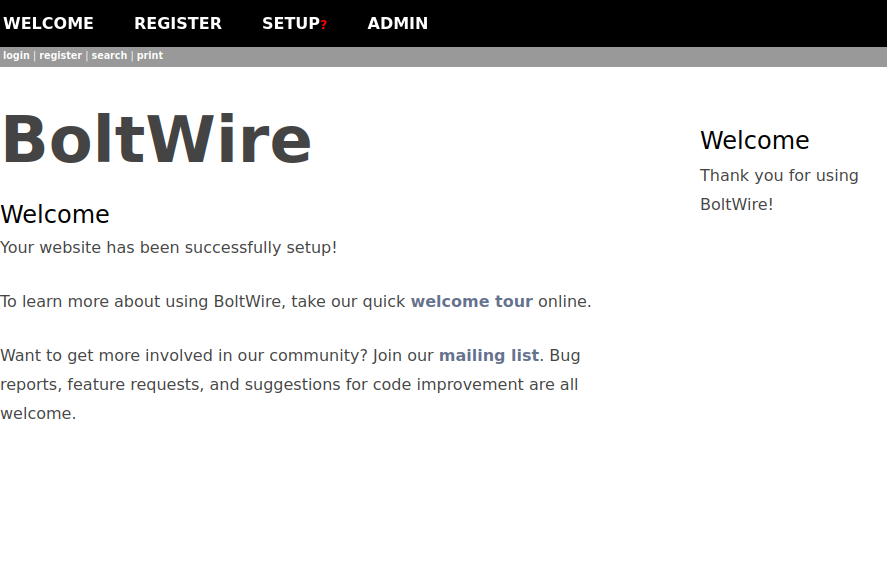
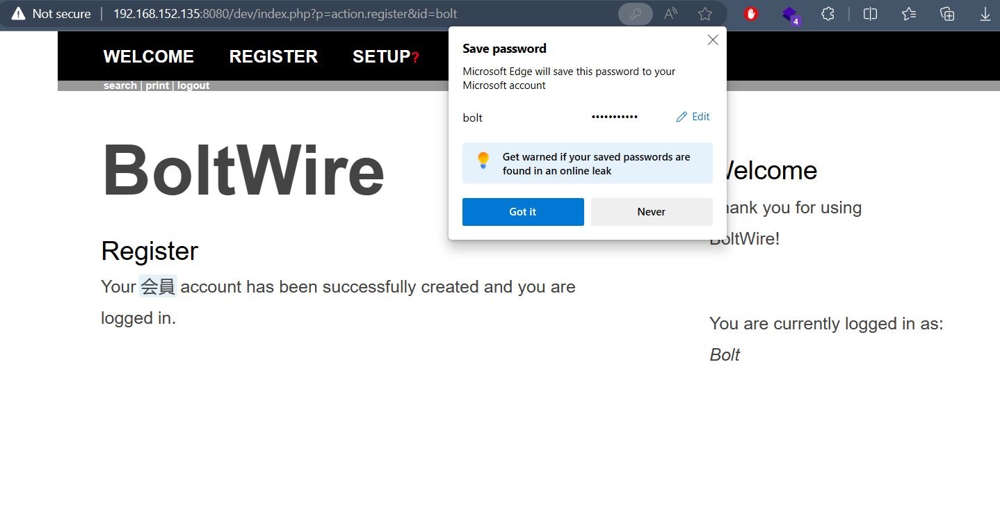
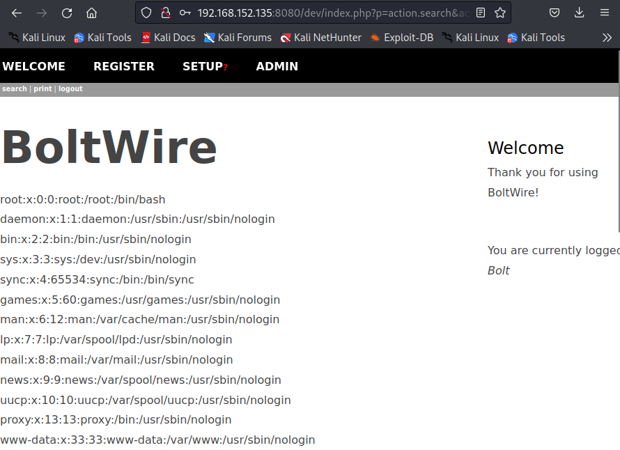

# Box3 - Dev VM Penetration Testing Walkthrough Training (TCM Sec)

1. Network scanning
- Scan the network to get target IP Address (still not understand how this will be used when there's a lot of other user in the same network to make sure we don't target the wrong victim)

- Scan the target IP Address\
\
Available ports and services:
- 22(ssh) -> OpenSSH 7.9p1 Debian 10+deb10u2 (protocol 2.0)
- 80/8080(http) -> Apache https 2.4.38 (Debian)
- 111(rcpbind) -> 2-4 (RPC #100000)
- 2049(nfs_acl) -> 3 (RPC #100227)
- 40637, 43461, 43827 (mountd) -> 1-3 (RPC #1000005)
- 44185(nlockmgr) -> 1-4 (RPC #100021)

2. (Vulnerabilities) information gathering of services
- Failure installation of bolt on the server

- Possible entry point from `rpcbind`: [RPCBind Pentesting](https://book.hacktricks.xyz/network-services-pentesting/pentesting-rpcbind)
- System information from port 8080

- Open file sharing network on port `2049 nfs_acl` and there are several mounted system there.

3. Port 80 and 8080 Directory Busting with ffuf
\
**Port 80 result:**
- src (301) - Directories
- app (301) - Directories
- vendor (301) - Directories
- extensions (301) - Directories
- server-status (403 -Forbidden)

**Port 8080 result:**
- dev (301) - Boltwire setup page
- server-status (403 - Forbidden)

4. At the same time ffuf running, see the mounted file on that IP Address: `showmount -e <target ip address>`
\
Get: path to the shared files
- Create a directory to mount to that shared folder

- Mount the newly created directory to the shared folder


5. Look through the file inside the shared folder
- Unzipping the file\
\
Notice that the zip folder contains 2 file: `id_rsa` and `todo.txt`
- Brute force the zip password with `frackzip`\

- Open the zip folder using the obtained password
\
Get: `id_rsa` key and `todo.txt`. Seems like the `id_rsa` can be used as key to connect via SSH.
\
However, it asks for password which is not known yet.

6. Looking for config file that is assumed to be correct by the owner
- Find it inside /app directory\

- Look inside the config file\
\
Get: Credentials for something!
```
driver: sqlite
databasename: bolt
username: bolt
password: I_love_java
```

7. Look around boltwire website
- There's login page, try out the combination

- There's registration page, try register using the credentials

- Notice the url change, try out admin id


8. Look for reported vulnerabilities of boltwire page
- Get: [Recent Boltwire - Local File Inclusion](https://www.exploit-db.com/exploits/48411)
- From `searchsploit` vulnerabilities

- Try the Local File Inclusion in the boltwire after **LOGIN**

\
Get: list of users running on that server. Also, the name of `jp` that put the `todo.txt` inside the zip file

9. Try to connect via ssh again
- Looks like this time, it asks for a passphrase. Try the `I_love_java` password.

- Other option would be trying to brute force the password

10. Look around using jeanpaul account
- See around and check if jeanpaul account is an admin account or not by `sudo -l`

- From `sudo -l` we can see commands that `jeanpaul` can run without password. Seems like the user can run zip with root privilege without the need of password
- Also check `history` when first time login to see what the user did previously

11. Escalate privilege just from `sudo zip`
- Look for [GTFOBins](https://gtfobins.github.io/) in browser and search "zip" inside `sudo` tab
\
Get:
```
TF=$(mktemp -u)
sudo zip $TF /etc/hosts -T -TT 'sh #'
sudo rm $TF
```
- Try to run the the first 2 commands in `jeanpaul` account and see if we can get into root shell


12. Get the flag form the root

